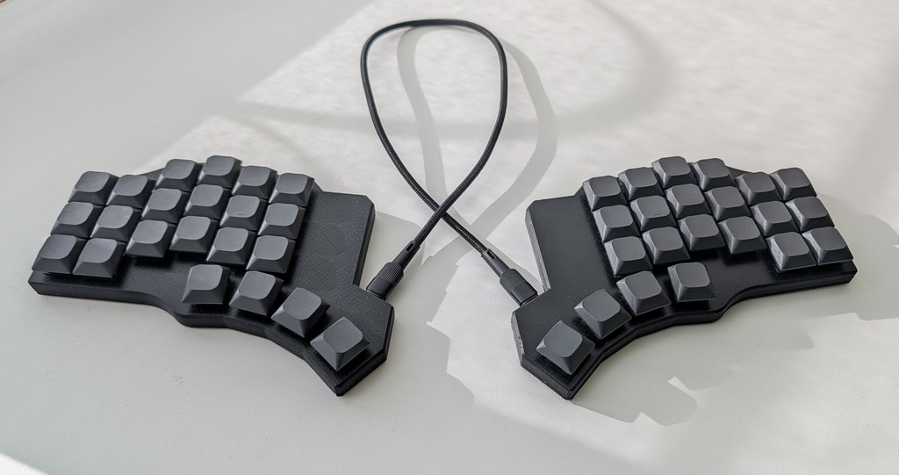

# Cantordeon

## Inspired by [El Cantor HS](https://github.com/azhizhinov/ELCANTORHS)
## Based on [Cornedeon](https://github.com/alko-kbd/cornedeon)

This keyboard a mod of El Cantor HS with rp2040 MCU and diode matrix, optimized for handwired.

* Keyboard Maintainer: [alko](https://github.com/alko-kbd/)
* Gallery: [Cornedeon](https://cornedeon.ru)
* Case 3D Model: [Thingiverse](https://www.thingiverse.com/thing:7161522)
* Hardware Supported: rp2040-zero

Versions cantordeon and cantordeon_ has uses differrent MCU pins. 

cantordeon_ pins optimized for handwired.

## Build firmware

* Prepare QMK/Vial build environment.
* Copy directory cantordeon (or cantordeon_) into keyboards/alko/. cantordeon used original El'Cantor HS layout, cantordeon_ layout optimized for handwire and unified with Cornedeon layout.
* qmk compile -kb alko/cantordeon -km vial 
* qmk compile -kb alko/cantordeon_ -km vial 

## Bootloader

Enter the bootloader in 3 ways:

* **Bootmagic reset**: Hold down the second key in top row and plug in the keyboard.
* **Physical reset button**: 
  * Press and hold the BOOT button.
  * Press and release the RESET button.
  * Release the BOOT button.

